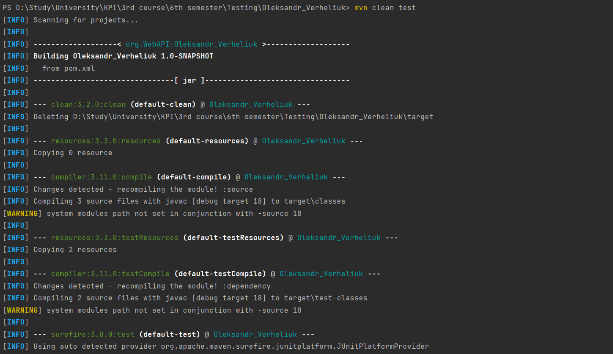
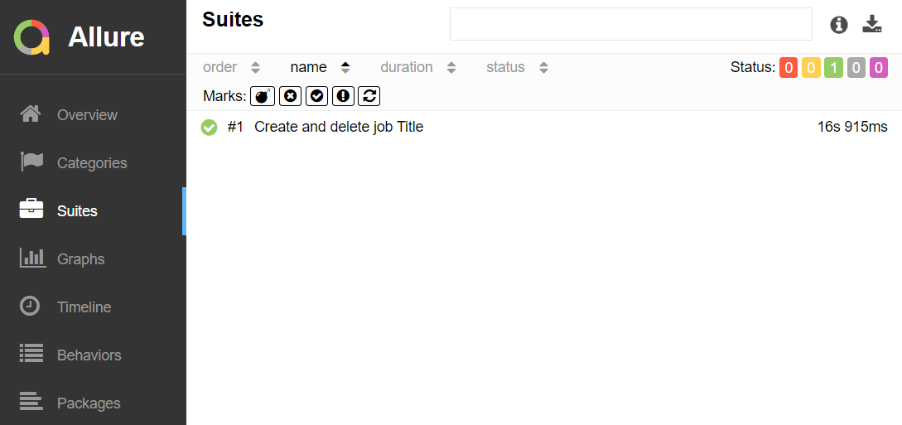

# Oleksandr_Verheliuk

In this repo there is program to do easy things with test site(https://opensource-demo.orangehrmlive.com/):
1. Log in
2. Add new job
3. Check that changes are visible on Job Title page
4. Delete my Job

In this project were used OOP principal. Was created helpfull class for Job. For execute actions on pages were created 3
pages classes with inheritance from parent class Page.

To run this project you should download it on your computer and run it in IDE.
You can run this project from command line, but you should install maven and add it to your PATH system variable
([guide](https://mkyong.com/maven/how-to-install-maven-in-windows/)). Also you should download in root of this repo
[chromedriver](https://chromedriver.storage.googleapis.com/index.html) for your Chrome browser version.
Then you can run project from terminal by command ``mvn clean test`` (example on screenshot).

For you comfort you can see testing result in Allure report by command in terminal ``allure serve`` (example on screenshot).

