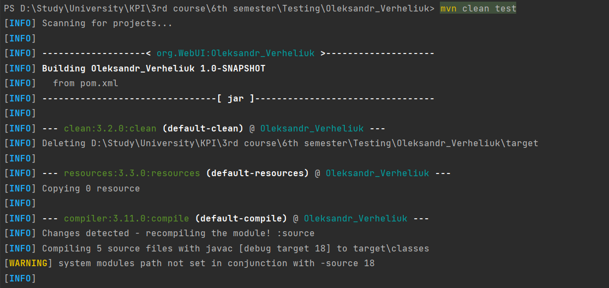

# Oleksandr_Verheliuk

In this repo there is program to do easy things with Dropbox by API:
1. Upload file
2. Get file Metadata
3. Delete file

In this project were used OOP principal, 2 main classes were created: Client to connect to Dropbox by API and 
HttpRequestBuilder to create requests.

To run this project you should download it on your computer and run it in IDE.
You can run this project from command line, but you should install maven and add it to your PATH system variable 
([guide](https://mkyong.com/maven/how-to-install-maven-in-windows/)).
Then you can run project from terminal by command ``mvn clean test`` (example on screenshot).

For you comfort you can see testing result in Allure report by command in terminal ``allure serve`` (example on screenshot).

